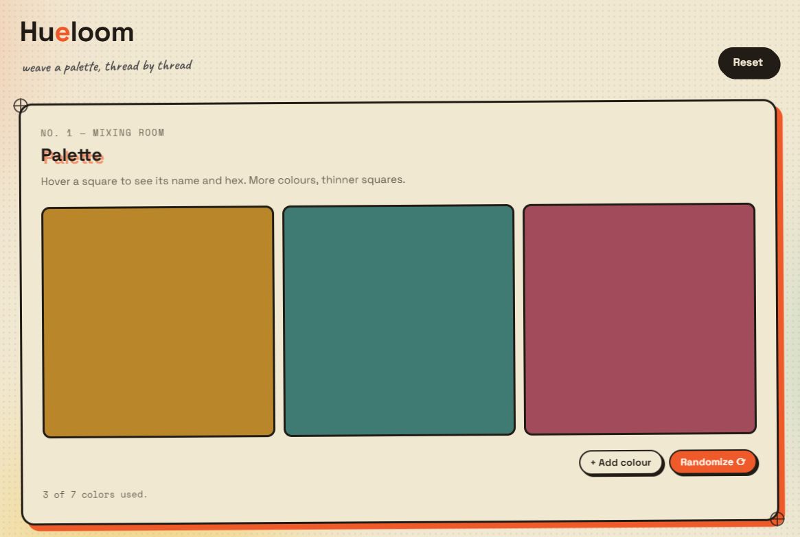

# Hueloom

**Mix, edit, and preview a colour palette — styled like a risograph print run.**

Hueloom is a small browser tool for building a colour palette and instantly seeing it applied to a sample interface, so you can tell whether your colours actually work together before you use them anywhere real.

🔗 **[Try it live](https://aisyah-rusdi.github.io/hueloom/)**

 

## What you can do

- **Build a palette** — start with 3 colours and add up to 7, shown as squares that share the row equally so you always see them at a glance. Hover a square for its name and hex code.
- **Fine-tune any colour** — pick one from the dropdown and change its hex, either by typing or with the colour picker. The old and new value are shown side by side so you can compare before committing.
- **See it applied** — a sample interface (header, sidebar, buttons, cards, text) is coloured live from your palette, cycling through your colours if you have fewer than seven. Shuffle which colour lands where with "Randomize style," or reset that mapping without touching your actual palette colours.
- **Nothing leaves your browser** — your palette is saved to `localStorage`, so it's still there next time you visit, and nothing is ever sent to a server.

## Contributing

Issues and pull requests are welcome. If you're proposing a bigger change, opening an issue first to talk it through is appreciated.

---

<details>
<summary><strong>For developers</strong></summary>

### Running it locally

```bash
git clone https://github.com/aisyah-rusdi/hueloom.git
cd hueloom
npm install
npm run dev
```

Then open the local URL it prints (usually `http://localhost:5173`).

### Deploying your own copy

This repo is set up to deploy to GitHub Pages with one command:

1. In `vite.config.js`, set `base` to match your repo name:
   ```js
   base: "/your-repo-name/",
   ```
2. Run:
   ```bash
   npm run deploy
   ```
3. In your repo's **Settings → Pages**, set the source to the `gh-pages` branch.

Your copy will be live at `https://<your-username>.github.io/<your-repo-name>/`.

### Project structure

```
src/
  App.jsx                  root component, wires state + sections together
  index.css                design system (tokens, panels, buttons, swatches, preview)
  hooks/usePalette.js      palette state, localStorage persistence, preview style-mapping
  utils/color.js           colour math (hex/HSL conversion, naming, contrast, random generation)
  components/
    Sheet.jsx               shared "print sheet" panel (registration marks + misregistered heading)
    RegistrationMark.jsx    small crosshair SVG used at each sheet's corners
    Swatch.jsx               individual palette square with hover info + delete
    PaletteSection.jsx       01 — Palette
    EditorSection.jsx        02 — Editor
    PreviewSection.jsx       03 — Preview
    Toast.jsx                small status toast
```

Built with React + Vite. `npm run build` produces a production build in `dist/`; `npm run preview` serves it locally to sanity-check before deploying.

</details>

## License

MIT — use it however you like.